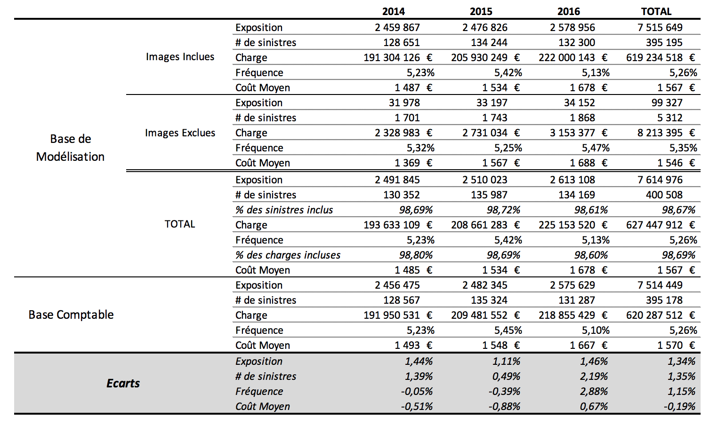

# Préparation des Données

La phase de préparation des données est la phase la plus critique du processus de modélisation. Toute erreur dans cette étape sera transmise jusqu'en bout de chaine. Or il est souvent très difficile de détecter les erreurs commises dans la préparation des données, tandis qu'il est plus facile de détecter les erreurs de modélisation. Pour limiter les risques d'erreur il est recommandé de mettre en place un processus défensif :

- automatisation des traitements pour limiter le risque d'erreur manuelle ;
- documentation des traitements pour permettre la maintenance future ;
- tests automatisés de cohérence des données ;

En fonction de la maturité du système d'information vous devrez réaliser un nombre d'étapes variables car certaines étapes seront peut-être réalisées de manière automatisée par votre SI. Par exemple certains systèmes d'information proposent directement une vision unifiée des événements contrats et sinistres et vous n'aurez pas besoin de faire cette réconciliation.

L'objectif général est de constituer une base d'images couvrant chacune une période de risque homogène pour un contrat. Chaque image possède une date de début et de fin d'effet, la liste des garanties couvertes, les facteurs de risque et enfin pour chaque type de sinistre : le nombre et le montant total.

Dans le cas le plus général la préparation des données pour la modélisation suit un processus en seize étapes :

1. Définition du périmètre ;
2. Identification des features ;
3. Retraitement des features ;
4. Création de nouvelle features ;
5. Classification des features ;
6. Extraction des mouvements des contrats ;
7. Extraction des sinistres ;
8. Jointure des contrats et des sinistres ;
9. Création des images ;
10. Calcul de l'exposition ;
11. Filtrage des images ;
12. Discrétisation des facteurs ;
13. Optimisation du format de stockage ;
14. Création des metadata ;
15. Réconciliation comptable ;
16. Documentation.

Chacune de ces étapes est détaillée dans la suite de ce chapitre et vous devez vous assurer que chacune d'entre elle est bien documentée pour pouvoir auditer la phase de préparation des données.

## L'approche Big Data : Utilisation de MapReduce

Pour définir les différentes étapes, nous utiliserons un modèle de donnée fondé sur les séquences d'événements (Event Driven Processing) car ce modèle est très approprié pour la manipulation de données temporelles. Dans ce modèle on peut distinguer trois types d'opérateurs :

1. Générateurs d'événements ;
2. Processeurs ;
3. Stockage ;

Ces opérateurs sont chainés pour créer le flux d'information partant des bases sources, transitant à travers les processeurs et finalement stockés dans la base finale d'apprentissage. Cela permet de bien distinguer chaque étape de la préparation des données. Il possible en pratique de combiner certaines étapes afin de gagner en rapidité de calcul, toutefois nous trouvons préférable de bien isoler chaque opération. L'avantage obtenu est de faciliter la compréhension et l'identification des éventuelles erreurs puisque chaque étape peut être testée individuellement.

Tous les calculs nécessaires se prêtent particulièrement bien à la décomposition dans le paradigme de programmation MapReduce utilisés par les moteurs de calcul parallèle big data. Hadoop et Spark sont actuellement les solutions open-sources les plus populaires et peuvent servir très utilement de support à la mise en œuvre des traitements proposés.

## Définition du périmètre

Avant toute modélisation technique il est important de définir le périmètre de l'étude suivant plusieurs axes :

- produit ;
- garanties ;
- période temporelle ;
- canal de distribution ;
- ...

### Produit

TODO

### Garantie

TODO

### Période Temporelle

TODO
tradeoff entre :
- récence des données ;
- quantité ;
- complétude ;
- homogénéité ;

Année complète

Même période pour modèle de fréquence et de cout moyen pour la réconciliation technico-comptable.

### Canal de Distribution

TODO

## Identification des features

TODO

### Contrats

TODO

### Sinistres

TODO

### Devis

TODO

### Service Client

TODO

### Télématique

TODO

## Retraitement des features

TODO

### Valeurs manquantes

TODO

### Valeurs absurdes

TODO

### Valeurs avec disparité temporelle

TODO

## Création de nouvelles features

TODO

### Facteur aléatoire

TODO

### Facteur temporel

TODO

### Ages

TODO

### Interactions

TODO

### Autres features

TODO

### Features Catégorielles et Ordinales

TODO

### Classification des features

Une fois que vous aurez créé toutes les features nécessaires à l'apprentissage, vous obtiendrez probablement une liste de plusieurs dizaines, voire plusieurs centaines de variable. Nous vous recommandons d'y mettre de d'ordre en classant vos variables et en les renommant de telle sorte que leur utilisation devienne intuitive et cohérente. Voici une liste d'idées que vous pouvez mettre en œuvre :

- Etablir une convention de nommage pour vos variables. Cette convention va définir la langue, la casse et les séparateurs utilisés, voici quelques exemples courants :

  - CamelCase ;
  - snake_case ;
  - CAPITAL_CASE ;

- Grouper les features par catégorie et préfixer les noms de variables. Par exemple si vos features sont issues de 4 bases de données différentes (client, contrat, sinistre, devis) vous pouvez envisager une notation similaire à celle-ci :

  - client.feature_1, client.Feature_x... pour les variables de la base client ;
  - contrat.features_1, contrat.feature_x... pour les variables contrats ;
  - sinistre.feature_x... pour les variables sinistres ;
  - devis.feature_x... pour les variables devis ;
  - cible.nb_sinistres_rc, cible.cout_sinistres_rc... pour les variables cibles.

- Identifier les interactions de manière intuitive. Une interaction peut être définie par la combinaison de plusieurs variables séparées par un caractère spécial, par exemple '\*' : Client.nb_contrats_*_type_logement.

- Distinguer les variables catégorielles et ordinales :

  - client.type_logement&, avec un caractère & à la fin pour identifier les variables catégorielles ;
  - client.age#, avec un caractère # à la fin pour identifier les variables ordinales ;

Libre à vous de choisir les catégories et les conventions qui vous semblent les plus pertinentes !

## Extraction des mouvements contrats

La base contrats contient les informations sur les garanties et les facteurs de risques. Cette base peut se présenter sous plusieurs formes en fonction de l'architecture de votre système d'information : une base unique contenant pour chaque contrat tout son historique, en ensemble de vues "photos" du portefeuille prise avec une fréquence régulière (mensuelle par exemple), ou bien encore la séquence de tous les événements survenus sur le portefeuille.

Dans le cadre de l'architecture orienté événement, la base contrat est un générateur d'événement. L'objectif est de générer un nouvel événement à chaque fois que la nature du risque est modifiée. Ainsi le risque couvert est constant dans la période entre deux événements et nous pourrons utiliser cette période pour la phase d'apprentissage statistique. Vous devez donc créer un nouvel événement dans les situations suivantes :

- début de la période d'observation ;
- fin de la période d'observation ;
- prise d'effet d'une (ou plusieurs) garantie ;
- suspension d'une (ou plusieurs) garantie ;
- début d'une année (ou de début de la durée de référence du reserving) ;
- modification d'un ou plusieurs facteur de risque :
  - déménagement ;
  - changement de véhicule ;
  - modification de la composition familiale ;
  - ...

Le générateur d'événement contrat est un opérateur *map* dans un environnement big data. Il prend en entrée une ligne par contrat et génère un ou plusieurs événements contenant au moins les attributs suivants :

- type d'événement = RISQUE ;
- numéro du contrat (pour le rattachement des sinistres) ;
- date : date d'effet ;
- indicatrices de couverture pour chaque garantie ;
- facteurs de risque ;

## Extraction des sinistres

La base sinistre est le deuxième générateur d'événements. En général son exploitation est plus simple que celle des bases contrats. Ce générateur est également un opérateur *map* dans un environnement big data. Il prend en entrée une ligne par sinistre et génère un événement avec au minimum les attributs suivants :

- type d'événement = SINISTRE ;
- numéro de contrat (pour le rattachement des contrats) ;
- date : date de survenance (et non pas date de déclaration) ;
- indicatrice de sinistre pour chaque type de sinistre modélisé ;
- montant du sinistre pour chaque type de sinistre modélisé ;

Il est possible d'avoir plusieurs types de sinistres modélisés par garantie, par exemple si vous choisissez de modéliser séparément les sinistres attritionnels et les graves.

Vous devez également noter la date d'observation des sinistres afin de pouvoir par la suite appliquer le coefficient de développement à l'ultime issu du triangle de reserving pour la date d'observation des sinistres.

### Vérification de la distribution des sinistres

TODO

Courbe du nombre de sinistres par bande de coût

## Jointure des risques et des sinistres

Cette étape de traitement prend en entrée les événements de type 'RISQUE' créés à partir de la base de contrats et les fusionne avec les événements de type 'SINISTRE' générés par la base des sinistres. Les événements sont regroupés par numéro de contrat et triés par date. Ceci est une opération de *réduction* dans le paradigme MapReduce.

## Création des images

Nous souhaitons maintenant construire des images, c'est à dire des périodes de risque constant associées avec la sinistralité observée. Pour cela nous combinons les événements 'RISQUE' et 'SINISTRE' dans un nouveau type d'événement 'IMAGE'. Une image commence avec un événement 'RISQUE' et se termine avec l'événement 'RISQUE' suivant. Chaque événement 'RISQUE' est donc utilisé deux fois : pour déterminer la fin d'une image et le début de la suivante. Exception faite pour le premier et le dernier événements qui sont utilisé une seule fois chacun pour marquer respectivement le début de la première image et la fin de la dernière.

Les images contiennent également les informations agrégées de tous les événement sinistres dont la date de survenance est comprise entre le début et la fin de l'image.

Ainsi chaque image contient les attributs suivants :

- type d'événements = 'IMAGE' ;
- numéro de contrat ;
- date de début : date de l'événement 'RISQUE' de début de période ;
- date de fin : jour précédant la date de l'événement 'RISQUE' de fin de période ;
- indicatrices de couverture pour chaque garantie de l'événement 'RISQUE' de début de période ;
- facteurs de risque de l'événement 'RISQUE' de début de période ;
- nombre de sinistre par type de sinistre, agrégés sur tous les événements 'SINISTRE' ;
- montant total des sinistres par type de sinistre, agrégés sur tous les événements 'SINISTRE' ;

Ceci est un opérateur *map* dans un environnement big data.

Erreur possible : des sinistres déclarés en dehors de la période de couverture ou sur une garantie qui n'est pas souscrite.

## Calcul de l'exposition

Comme nous l'avons vu plus haut un même contrat est découpé en plusieurs images de durée inégales afin de garantir que chaque image reflète un risque constant.

Cette opération *map* ajoute, pour chaque image, sa durée d'exposition. L'exposition est la durée de couverture normalisée sur une année. Nous recommandons de calculer l'exposition comme la durée en jour de l'image divisée par 365. La durée de l'image doit être calculée en incluant la date de début et la date de fin. En effet la date de fin, par construction, précède d'un jour la date de début de l'image suivante.

Pour éviter d'avoir une exposition légèrement supérieure à 1 les années bissextiles nous recommandons de supprimer un jour d'exposition pour toutes les périodes contenant un 29 février.

## Filtrage des images

Vous devrez parfois exclure certaines images de la base de modélisation, par exemple :

- les images avec une exposition nulle ;
- les sinistres ouverts à une valeur forfaitaires ;
- ...

Vous devez conserver et identifier toutes les images écartées de la base de modélisation. En effet vous devrez par la suite les réintégrer dans les calculs de réconciliation comptable.

## Discrétisation des facteurs

Cette opération *map* permet de discrétiser les facteurs de risque évalués sur une échelle continue. Par exemple la longueur d'un véhicule doit être transformée en plage de longueur, exemple : [0cm-200cm], [200cm-240cm], [240cm-280cm] ...

A la fin de cette étape nous disposons d'une base de données au format texte qui est utilisable pour la modélisation statistique de la prime pure.

## Optimisation du stockage

La plupart des algorithmes de data-science utilisent en entrée des nombres en virgule flottante encodés sur 8 octets, soit 64 bits. Dans le cas des modélisations en tarification IARD nous utilisons des variables discrétisées et l'encodage standard sur 64 bits est inefficace.

Nous recommandons donc de limiter le nombre de modalités par feature à 256 modalités. Comme il est possible d'encoder 256 états dans un octet de 8 bits, nous pouvons donc encoder chaque facteur sur un octet. Le bénéfice est double : des économies de mémoire et de meilleurs temps de calcul.

Cette opération *map* est optionnelle mais très utile pour la modélisation de grands portefeuilles.

Les valeurs cibles et la variable "exposition" prennent des valeurs réelles continues et il est plus commode de conserver l'encodage standard en virgule flottante.

## Création des Metadata

Une fois votre base de données constituée, nous vous recommandons de constituer un fichier avec les metadata de la base de données afin de pouvoir les transmettre très facilement aux outils de modélisation. L'importance de cette étape est souvent sous-estimée car au moment de la création de la base les équipes ont toutes les données en tête. Toutefois cette étape est cruciale pour permettre l'industrialisation avec l'intégration des processus de préparation des données puis de modélisation. C'est aussi une étape essentielle pour la bonne documentation des travaux et garantir la capacité future à réutiliser et vérifier le travail réalisé. Nous vous recommandons d'utiliser un format structuré standard, par exemple le format JSON qui permet de garantir une très grande compatibilité. Voici une liste minimum des metadata que vous souhaiterez conserver dans un format structuré :

- date de création ;
- nom du projet ;
- description ;
- nombre de lignes ;
- nombre et liste des features ;
- nombre et liste des indicatrices de garantie ;
- nombre et liste des cibles ;
- nom de la variable "exposition" ;
- nombre et liste des modalités ordonnée par feature ;
- code numérique associé à chaque modalité ;

TODO schéma de la base finale

## Réconciliation comptable

La réconciliation comptable est une étape de validation importante. Elle permet de vous assurer que votre base d'apprentissage est cohérente avec vos données business.

Pour cela vous devez confronter vos données avec une source indépendante, idéalement une source comptable de référence. Vous devez vous assurer, pour chaque période comptable de modélisation (en général une année), que les principales statistiques sont égales :

- Exposition ;
- Nombre de sinistre ;
- Cout total ;

Pour cela vous devrez calculer ces éléments d'un coté sur les images incluses dans la base de modélisation, et de l'autre sur les images exclues et additionner les deux pour confronter le résultat à la vision comptable.

\clearpage

Nous vous recommandons d'utiliser, pour chaque garantie, un tableau similaire à celui de la figure ci-dessous :

{ height=60%  width=100% }
\

Points de vérification :

 - L'exposition, la charge totale et le nombre de sinistres, doivent être comparables pour chaque année sur :
  - le total de la base de modélisation, y compris les images exclues ;
  - la base comptable.

## Documentation

La documentation de la phase de préparation des données est souvent lacunaire car les équipes pensent, à tort, que cela ne crée pas de valeur. Nous avons pu constater que les équipes passent souvent trop rapidement à la phase de modélisation sans avoir sufisament documenté la constitution de la base. Ce qui semble un gain de temps à court terme, ce révèle souvent une perte de temps à long terme car il n'est pas rare de s'apercevoir en fin de modélisation que la base utilisée était biaisée et devoir recommencer le travail.

Mettre par écrit, de manière formalisée, toutes les étapes de la préparation de la base permet de partager les informations, de détecter les incohérences, et de les corriger. De plus c'est sur la base de cette documentation que le management et les auditeurs externes se forgeront une idée de la qualité et donc de la confiance qui doit être accordée au travail réalisé. D'une certaine manière vous devez considérer que la documentation est le véritable "livrable" de la phase de préparation des données.

Vous devez commencer à documenter les progrès dès le début de vos travaux et ensuite de manière continue jusqu'à l'achèvement complet. En procédant ainsi vous obtenez un double bénéfice. En premier lieu, cela facilite le travail de rédaction et de formalisation qui se réalise au quotidien et non pas à la fin. En second lieu la formalisation continue permet de partager les avancées, de détecter très tôt les éventuelles erreurs et permet de restituer tout le cheminement intellectuel qui a permis d'aboutir aux résultats proposés.

Pour obtenir une documentation de qualité, vous devez vous assurer que votre équipe ait les bons objectifs et la culture adaptée. Vous devez élaborer les objectifs de tels sorte que la documentation soit au cœur des résultats attendus. Par exemple vous pouvez formuler l'objectif : *la phase de data préparation est achevée lorsque l'équipe de seconde opinion valide la méthodologie sur la base de la documentation*.

### Check-list

Voici une check-list des éléments minimums qui doivent être documentés pour la phase de préparation des données :

- dictionnaire des données ;
- traitements réalisés avec la description textuelle et le code associé ;
- données d'entrées ;
- base(s) d'apprentissage générée(s) avec leurs metadata ;
- calcul de la réconciliation comptable ;
- distribution des sinistres en nombre et en coût.
