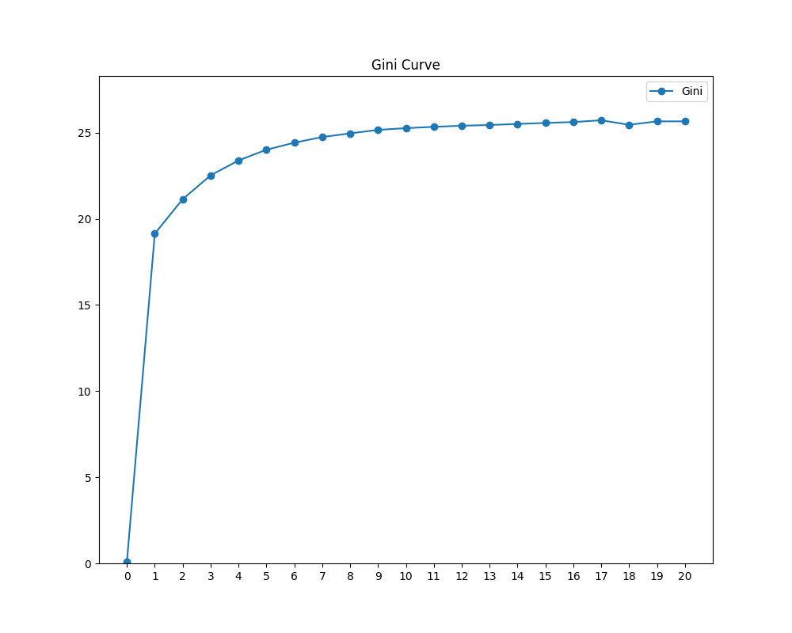

# Sélection des variables

Nous disposons grâce au big data d'un nombre toujours plus grand de variables à tester pour nos modèles. Toutefois il est illusoire de vouloir toutes les utiliser dans un modèle de production. La bonne sélection des variables est probablement l'étape la plus importante de la modélisation et cela se renforce à mesure que notre capacité à traiter de nouvelles variables s'accroît.

## Objectifs

Dès lors que vous disposez d'un grand nombre de variables (plusieurs dizaines), on constate qu'il est souvent possible d'obtenir des performances prédictives proches avec des variables différentes. Il est donc important de bien définir vos objectifs pour guider vos choix.

### Performance Prédictive

La performance prédictive vient tout naturellement à l'esprit comme le premier critère de choix. C'est malheureusement parfois le seul qui est pris en compte. Le choix des variables devrait toutefois prendre en compte d'autres critère, même si cela fait perdre quelques dixièmes de point de gini.

### Simplicité

*« La simplicité est la sophistication suprême »* selon Léonard de Vinci. Cette maxime s'applique bien à la modélisation IARD. Pour une même puissance prédictive les modèles les plus simples sont souvent les plus longs à réaliser.

Pour obtenir des modèles simples, voici quelques pistes :

- diminuer le nombre de variables utilisées ;
- diminuer le nombre de modalités utilisées ;
- diminuer le nombre d'interactions utilisées.

### Interprétabilité

Vous souhaiterez probablement communiquer de manière pédagogique sur les variables constituant vos modèles. Cela est d'autant plus facile que vos features sont faciles à interpréter. Imaginons par exemple que vous ayez le choix, en assurance automobile, entre deux variables véhicule :

 - la somme de la longueur et de la largeur du véhicule ;
 - le poids du véhicule ;

A pouvoir prédictif égal (ou très proche), il est préférable d'utiliser le poids du véhicule qui est plus facilement interprétable.

### Sens business

Il est possible qu'une variable sans relation évidente avec le risque modélisé présente pourtant une forte corrélation avec la variable cible. Il est tentant de l'inclure dans le modèle car cela peut augmenter la capacité prédictive du modèle. Nous recommandons de préférer des variables dont on comprend intuitivement l'impact sur la sinistralité.

### Robustesse

La robustesse est la capacité d'un système à se maintenir dans le temps et à résister aux événements exceptionnels. Pour la sélection des variables dans un modèle, vous devez réfléchir à la stabilité de la variable dans le temps et ce qu'il advient en cas de valeurs extrêmes.

Les variables renseignées à la souscription, puis qui ne sont plus jamais mises à jour, sont par exemple à éviter. Il est utile de connaitre les processus opérationnels de mise à jour. Par exemple le statut marital (célibataire, marié, veuf, ...) est une donnée qui évolue avec le temps et dont la pertinence s'émousse au fil des ans si elle n'est plus mise à jour.

Les "outliers" (cas extrêmes) sont également à considérer : vos variables sont-elles susceptibles de prendre des valeurs exceptionnelles? Comment cela se traduit-il dans les prédictions ? Par exemple, quelle est la prédiction de votre modèle de coût incendie pour une maison de 42 pièces ?

### Disponibilité

Certaines variables ne sont pas disponibles ou sont imparfaitement connues au moment du calcul opérationnel. Par exemple le mode de paiement n'est probablement pas encore déterminé lors de l'édition d'un tarif pour un prospect. Vous devrez privilégier les variables qui seront disponibles dans les systèmes de production.

### Crédibilité

Les variables reflètent de manière imparfaite la réalité, surtout si une partie prenante y trouve un avantage. Par exemple, il n'est pas possible de vérifier la durée d'assurance chez l'assureur précédent. Si la variable est utilisée dans les processus opérationnel, il y a un risque que les clients ou les intermédiaires déclarent des valeurs inexactes pour optimiser leur tarif.

Lors du choix d'une variable vous devez vous demander si le processus de collecte permet de garantir, avec un degré de confiance suffisant, la qualité de la donnée.

### Cout d'acquisition

La collecte et le stockage d'une donnée a toujours un coût. Essayez d'identifier les coûts associés à chaque variable et privilégiez celles qui sont les moins chères. Pour les variables les plus onéreuses, calculez leur rentabilité en estimant l'avantage compétitif procuré par l'intégration de la variable dans le modèle.

### Expérience client

On ne pense jamais trop au client. Vous devez chercher à minimiser le nombre, la complexité et la sensibilité des données collectées. Attention le nombre absolu ne doit pas être l'unique critère car il vaut mieux demander deux données simples plutôt qu'une compliquée ; deux données anodines plutôt qu'une donnée considérée sensible.

### Éthique

Certaines données sont sensibles car leur utilisation pourrait créer des situations de discrimination : nationalité, ethnie, religion, handicap, ... Vous pouvez les exclure d'office.

### Législation

La législation de votre pays peut vous contraindre dans le choix des variables de pricing. Si certaines variables impactantes sont interdites, il est judicieux de rechercher des variables alternatives que vous pourrez utiliser dans vos processus opérationnels.

### Stratégie

Enfin il vous revient en dernier lieu de décider de votre stratégie de pricing et privilégier certaines catégories de variables. Par exemple, en assurance automobile, vous pouvez décider de favoriser les variables collectées par la télématique^[La télématique désigne les objets connectés transmettant des données de conduite avec l'accord de l'assuré. Le plus souvent il s'agit du téléphone portable de l'assuré.] pour développer son usage.

## Sélection Manuelle

Les exemples précédents nous montrent combien il est illusoire de pouvoir réaliser une sélection de variables entièrement automatisée. Bien au contraire, la sélection des variables relève de l'opinion, c'est à dire d'un choix subjectif qui requiert une expérience approfondie du domaine modélisé. Ce choix est le résultat d'un processus empirique pour trouver les "meilleures" variables en fonction des objectifs business.

En raison de la croissance rapide du nombre de variables exploitées il est toutefois utile de mettre en place des procédures automatisées pour accélerer la recherche des meilleures variables.

Dans les prochaines sections nous expliquerons les différentes méthodes disponibles et celles qui nous paraissent les plus appropriées dans le contexte big data.

## Best Subset

La méthode *Best Subset* (meilleur sous-ensemble en français), est une approche par la force brute qui teste tous les modèles possibles. Le nombre de modèles pour p variables est égal à $2^p$^[Le nombre de modèles avec au plus n variables est la somme des combinaisons possibles de k variables parmi p avec k variant de 1 à p : $\sum_{k=1}^{p}\binom{p}{k}=\sum_{k=0}^{p}\binom{p}{k}-1=2p−1$] et la puissance de calcul nécessaire croît donc de manière exponentielle avec le nombre de variables du dataset. Cette méthode présente également un fort risque de surapprentissage. Evitez donc de l'utiliser car elle n'apporte pas d'avantages sur les méthodes pas à pas qui sont tout aussi simples à mettre en œuvre, tout en étant moins gourmandes en puissance de calcul.

## Sélection Pas à Pas (stepwise)

### Backward Stepwise

La méthode *Bacward Stepwise*, (sélection à recul pas à pas en français), est intuitive et sa mise en œuvre très facile. Elle peut se faire de manière manuelle ou automatisée. Cette méthode démarre par apprendre le modèle complet, contenant toutes les variables ; puis on élimine à chaque itération la variable dont la perte engendre la moindre détérioration du modèle, jusqu'à ce que toutes les variables aient été enlevées, où que l'on décide de s'arrêter prématurément avec un nombre de variables satisfaisant.

On obtient une suite de modèles imbriqués avec un nombre de variables décroissants : $(\mathcal{M}_p, \mathcal{M}_p-1, ..., \mathcal{M}_2, \mathcal{M}_1, \mathcal{M}_0)$, avec p = nombre de variables.

Le modèle final est sélectionné dans cette suite de modèles imbriqués, en général en utilisant une métrique de capacité prédictive.

#### Algorithme

1. Sélectionner toutes les variables ;
2. Apprendre le modèle $\mathcal{M}p$ avec toutes les variables ;
3. Apprendre tous les modèles avec une variable en moins ;
4. Supprimer la variable ayant la moindre importance ;
5. Reprendre à l'étape 3 tant qu'il reste des variables sélectionnées ;
6. Sélectionner le modèle final parmi tous les modèles imbriqués créés.

### Forward Stepwise

La procédure *forward stepwise*, sélection par avancée pas à pas en français, est similaire à la procédure par recul pas à pas. Au lieu de commencer avec le modèle complet contenant toutes les variables, on commence au contraire avec le modèle nul contenant seulement la coordonnée à l'origine (intercept), sans aucune variable explicative. La procédure ajoute ensuite à chaque étape la meilleure variable parmi celles qui ne sont pas encore sélectionnées.

#### Algorithme

1. Sélectionner l'intercept ;
2. Apprendre tous les modèles possibles avec une variable additionnelle ;
3. Ajouter la variable ayant la plus forte importance ;
4. Reprendre à l'étape 2 tant qu'il reste des variables non sélectionnées ;
5. Sélectionner le modèle final parmi tous les modèles imbriqués créés.

### Critère de sélection d'une variable

Les méthodes pas à pas nécessitent de définir deux critères :

- à chaque itération : le critère de choix de la variable à exclure (backward) ou à inclure (forward) ;
- le critère de choix du modèle final.

La clef du succès de ces méthodes réside dans le choix de critères pertinents pour ces deux étapes. Comme il existe plusieurs possibilités pour chacun des deux critères, les combinaisons très nombreuses et ces méthodes sont en réalité des familles de méthodes qui se déclinent suivant les critères choisis pour l'élimination des variables et le choix du modèle final.

Pour déterminer la variable la plus significative (forward stepwise) ou la moins significative (backward septwise) il est possible d'utiliser plusieurs métriques.

#### p-value

TBW

#### Norme 2 des coefficients

TBW

#### CGini

TBW

#### Spread 100/0

TBW

#### Spread 95/5

TBW

#### AIC

TBW

#### BIC

TBW

#### Gini

TBW

#### Déviance

TBW

#### Complexité calculatoire

Dans leur version canonique, les algorithmes pas à pas nécessitent d'apprendre $p$ modèles à la première itération, $p-i$ modèles à l'itération $i$ et aucun modèle à l'itération finale (puisqu'il n'y a plus qu'une seule variable et qu'il n'est donc pas strictement utile de réaliser un modèle pour la choisir). Le nombre total de modèles calculés est donc :
\begin{equation}
\sum_{k=0}^{p-2}p - k = \sum_{k=2}^{p}k = p * (p + 1) / 2 - 1
\end{equation}

La complexité algorithmique de cette approche est donc quadratique suivant le nombre de variables : $\mathcal{O}(p^2)$. C'est bien meilleur que la force brute $\mathcal{O}(n^p)$, toutefois cette compléxité superlinéaire est peu adaptée pour les approches big data : quand on double le nombre de variables on quadruple la puissance de calcul nécessaire.

Pour pallier ce problème il est possible d'utiliser des variantes gloutonnes (greedy) en anglais qui nécessitent moins de calculs : elles suppriment l'étape 3 et fournissent directement une estimation de la variable à sélectionner (forward) ou exclure (backward).

### Avantages

Les méthodes pas à pas possèdent deux avantages : leur simplicité de mise en œuvre et l'absence de méta-paramètre. Cette absence de méta-paramètre est intéressante par rapport à d'autres méthodes car il n'y a ni grid-search, ni validation croisée.

### Limitations

#### Nombre de variables

Si le nombre de variables explicatives est important, en pratique au-delà de quelques milliers, le temps de calcul nécessaire à une procédure pas à pas complète peut devenir excessif. Il est également possible que le calcul du modèle complet pour démarrer la procédure backward soit hors de portée. De plus, le nombre de variable dans la procédure augmente le risque de surapprentissage.

Dans ce cas, il peut être préférable d'utiliser une pénalisation Lasso qui traite de manière efficace cette situation.

#### Triturage des données

Les méthodes pas à pas sont controversées car elles réutilisent plusieurs fois les informations de la base de données et cela les rend sensibles au surapprentissage par "triturage des données". Le triturage des données est une technique statistique qui consiste à ne conserver que les résultats intéressants. Ce phénomène apparaît par exemple en médecine, où, à partir d'un grand nombre de données (poids, âge de l'éventuelle première cigarette, etc.) et d'un grand nombre de résultats possibles (cancer du sein, cancer du poumon, accident de voiture etc.) des associations hasardeuses sont faites (a posteriori), et « validées » statistiquement. Ainsi, comme les procédures pas à pas choisissent toujours le meilleurs modèle à chaque itération, les mesures statistiques (exemple : la p-value) sont biaisées sur la base d'apprentissage et peuvent donner une impression meilleure que la réalité.

#### Remède au triturage des données

Pour remédier au triturage des données, il existe heureusement plusieurs pratiques que vous pouvez mettre en place :

1. Big Data : Utilisez le plus grand nombre possible d'observations pour l'apprentissage. En effet, le risque de surapprentissage diminue avec la taille de la base d'apprentissage.
2. Échantillon de test : Calculez les métriques finales sur un échantillon test choisi de manière aléatoire et qui n'aura pas été utilisé durant toute la phase d'apprentissage ;
3. Choix des critères : Utilisez un critère de choix des variables peu propice au surapprentissage. Par exemple le spread 95/5 est plus robuste que le spread 100/0.

### Sélection non optimale des coefficients

Les processus pas à pas ne peuvent pas garantir l'optimalité des modèle créés. En effet, il est possible qu'une variable sélectionnée dans un processus forward ne soit plus la meilleure disponible quelques itérations plus tard. De la même manière, une variable exclue en backward peut devenir une variable pertinente dans un modèle plus simple ultérieur. Cela est particulièrement vrai si les facteurs explicatifs sont corrélés.

## Pénalisation Lasso

La régularisation des coefficients réalisée par l'introduction d'une pénalistion lasso dans le modèle est une méthode "intégrée" qui réalise la sélection des variables en même temps que l'apprentissage du modèle.

### LASSO

Le LASSO (Least Absolute Shrinkage and Selection Operator) est une méthode statistique de contraction et de sélection des coefficients d'un modèle linéaire qui a été inventé par Robert Tibshirani dans un article^[Robert Tibshirani, *« Regression shrinkage and selection via the lasso »*, Journal of the Royal Statistical Society. Series B, vol. 58, n°1, 1996, p. 267-288.] publié en 1996.

Le Lasso rajoute une contrainte à l'équation d'apprentissage : minimiser la somme des valeurs absolues des coefficient, aussi appelée norme $l_{1}$, telle que $\mid\mid\beta\mid\mid_{1} = \sum _{j=1}^{p}{\mid\beta _{j}\mid}$. Un paramètre de seuillage $\lambda_{1}\ge0$ contrôle le niveau de contraction des coefficients.
\begin{equation}
\min _{\beta _{j}}\sum _{i=1}^{n}f_{loss}(y_{i},\sum _{j=0}^{p}\beta _{j}x_{i,j})+\lambda_{1} \mid\mid\beta\mid\mid_{1}
\end{equation}

La particularité du lasso est de contracter certains coefficients à zéro grâce à la forme particulière de la pénalité $l_{1}$ qui est non différentiable en 0, ce qui crée un seuillage absorbant dans l'intervalle $[-\lambda_{1};\lambda_{1}]$. Tous les coefficients dont la valeur se situe dans cet intervalle sont mis à zéro. Cela permet de réaliser une sélection des variables.

### Pari sur la parcimonie

 Le lasso fonctionne d'autant mieux qu'il y a un faible nombre de variables qui ont de l'importance dans la prédiction. Ces bases de données sont qualifiées de parcimonieuses : il y a peu de variables corrélées avec la cible. Dans cette situations le vecteur des coefficients d'apprentissage est "creux" et la base d'apprentissage est appelée "parcimonieuse". C'est notamment le cas dans le domaine de la génomique avec plusieurs millions de gènes analysés dont seuls quelques-uns sont impliqués dans la maladie étudiée. Robert Tibshirani appelle cela le *« pari sur la parcimonie »*^[Pour plus de détails sur le "pari sur la parcimonie" voir le \S 16.2.2 du livre *«The Elements of Statistical Learning»*, Trevor Hastie, Robert Tibshirani, Jerome Friedman.].

### Avantages

Les principaux avantages du lasso sont :
- une sélection parcimonieuse des features dont le nombre dépend du paramètre $\lambda_{1}$ ;
- robustesse au surapprentissage ;
- intégration de l'apprentissage et de la sélection des variables dans une même opération.

### Limites

 En contrepartie, le lasso a également certaines limites :

- exclusion des variables corrélées ;
- coefficients non optimaux ;
- sélection des coefficients non optimale ;
- introduction d'un meta-paramètre supplémentaire.

#### Variables corrélées

Si la base d'apprentissage contient des features corrélées entre elles, et qui sont importantes pour la prédiction, le lasso risque de n'en sélectionner qu'une seule et d'écarter les autres au dépend de la qualité de prédiction.

#### Coefficients non optimaux

Dans l'hypothèse, fréquente en pratique, où la base d'apprentissage est dense, l'estimateur lasso est biaisé et les coefficients ne sont pas les mêmes que ceux obtenus avec une régression sur le "support" (le sous-ensemble des variables dont le coefficient est différent de zéro). Le biais introduit rend le modèle plus robuste et réduit le risque de surapprentissage, ce qui est parfois bénéfique, toutefois cela peut également se faire au détriment de la capacité prédictive du modèle.

#### Sélection non optimale des coefficients

Toujours dans le cas d'un dataset dense, la sélection des coefficients par le lasso n'est pas toujours optimale car elle est régie par la taille des coefficients uniquement et ne prend pas en compte la significativité statistique. Un fort coefficient n'est pas forcément synonyme de significativité statistique, surtout si les données n'ont pas été normalisées.

#### Meta-paramètre supplémentaire

L'introduction du paramètre de seuillage $\lambda_{1}$ introduit une complexité dans le processus d'apprentissage. Il faut rechercher le meilleur paramètre $\lambda_{1}^{*}$ de manière empirique, par :

  1. essais successifs de différentes valeurs (grid search) ;
  2. et sélection du meilleur paramètre $\lambda_{1}^{*}$ par validation croisée.

### Group Lasso

L'idée du lasso groupé est de réaliser la sélection par groupe de variables. Cela est très utile pour les variables catégorielles qui sont encodées avec des colonnes binaires (one hot encoding). Le group lasso permet de regrouper ensemble toutes les modalités d'une variable et sélectionne/désélectionne ensemble toutes les modalités d'une même variable. A l'intérieur d'un groupe de variable le group lasso réalise une pénalisation $l_{2}$ qui s'assimile à la méthode Ridge (cf. chapitre suivant). Si $G$ est une partition des coefficients $\beta_{j}$ et pour $g \in G$, $\beta_{g}$ est le vecteur creux contenant uniquement les coeffient $\beta_{j} \in g$, l'objectif du group lasso est alors :
\begin{equation}
\min _{\beta _{j}}\sum _{i=1}^{n}f_{loss}(y_{i},\sum _{j=0}^{p}\beta _{j}x_{i,j})+\lambda_{1} \sum_{g \in G} \omega_{g} \mid\mid\beta_{g}\mid\mid_{2}
\end{equation}

### Utilisation

Dans le cadre des régressions actuarielles, le group lasso peut être utilisées comme un outil pour la sélection automatisée des variables. Toutefois les bases d'apprentissages sont le plus souvent denses et le pari sur la parcimonie devient caduque. Les limitations du lasso sont souvent atteintes et dans ces conditions le lasso ne garantit ni l'optimalité de la sélection des variables, ni l'optimalité des coefficients. De plus la mise en œuvre de ces méthodes est complexe et non standardisée en raison de la sophistication mathématique requise et de l'introduction d'un ou plusieurs méta-paramètre supplémentaires à optimiser. Son utilisation n'est pas encore répandue et est un domaine d'expérimentation actif^[A la date d'écriture de ce livre, une startup est en cours de développement au sein de l'incubateur Kamet pour proposer un outil de modélisation actuarielle par régression pénalisée.].

## Greedy Process

[A revoir entièrement]

Les *processus de sélection gloutons* (greedy en anglais)

## Méthodes combinées

Les méthodes combinées sont des approches empiriques qui utilisent les méthodes déjà exposées comme briques de base pour créer un processus de sélection en plusieurs étapes pour tirer parti des forces de chaque méthode.

Par exemple, dans le cas d'une base de données avec 1000 variables on peut envisager de réaliser en chaîne les 2 étapes suivantes :

- régression pénalisé lasso pour réduire le nombre de variables étudiées à 100 ;
- backward stepwise à partir du modèle lasso à 100 variables ;

### Procédure bidirectionnelle

Dans une procédure bidirectionnelle on combine les approches forward et backward, en testant à chaque étape les variables à inclure ou exclure.

## Sélection du modèle final

Quelle que soit la méthode utilisée pour la recherche des variables, procédure stepwise ou pénalisation, vous allez obtenir un ensemble de modèles utilisant un nombre différent de variables et vous devez choisir le modèle final parmi tous ces modèles. Il existe bien sûr plusieurs méthodes et nous en exposons ici quelques-unes parmi les plus utiles.

### Nombre de variables maximum

Le critère le plus simple est celui du nombre de variable. Il est souvent utile de se donner un nombre maximum de variables dans le modèle. Dans ce cas on choisit donc le modèle correspondant à ce maximum. Ce critère peut être composé avec d'autres critère qui permettent de limiter davantage le nombre de variables utilisées.

### Critère sur les variables

Il est possible de sélectionner le modèle final sur les caractéristiques des variables utilisées par les modèles. Par exemple on peut envisager de sélectionner le modèle qui possède le plus de variables ayant toutes un Spread95/5 supérieur à 10%.

### Gain sur la performance

En pratique on souhaite souvent sélectionner le modèle qui réalise le meilleur compromis entre nombre de variables utilisé (simplicité) et performance. Une méthode naïve pour réaliser cet arbitrage est d'exiger que le modèle choisi fournisse un gain "suffisant" par rapport au modèle précédent. Par exemple on pourra choisir le dernier modèle permettant de gagner au moins 0,1% de gini par rapport au précédent. Cette méthode s'apparente à la méthode graphique du chemin de sélection (cf. ci-dessous).

### Chemin de sélection

Le chemin de sélection est un graphique qui permet de visualiser la performance prédictive obtenue en partant d'un modèle sans aucune variable et en sélectionnant une variable de plus à chaque nouvelle étape. Le graphique est tracé avec le nombre de variables sélectionnées en abscisses et la performance prédictive en ordonnées (gini, réduction de la déviance, ...).

{ height=80%  width=100%}
\

Le chemin de sélection vous permettra de choisir le nombre optimal de variables à retenir dans votre modèle final. Sur le graphique ci-dessus nous pouvons déterminer que le nombre optimal de variable se situe autour de neuf.

Comme vous pouvez le constater, la performance d'un modèle a tendance à plafonner et le gain marginal obtenu en rajoutant de nouvelles variables diminue. C'est un exemple de la loi des rendements décroissants. Si votre processus de sélection des variables est performant chaque variable supplémentaire vous permet de gagner en performance, mais moins que la précédente. Il arrive même fréquemment qu'au-delà un nombre critique de variables la performance du modèle diminue. C'est une illustration du surapprentissage.

## Recommandations pour le big data

Pour l'apprentissage sur des données big data il faut favoriser les algorithmes rapides et efficaces. Nous vous recommandons de mettre en place un processus "glouton" bâti à partir de briques élémentaires simples comme les méthodes forward et backward stepwise.

Dans notre outil de pricing IARD, nous avons abouti, par itération successive, au processus de sélection des variables suivant :

1. **Backward stepwise** en supprimant à chaque étape la variable avec le plus faible CGini. Le gini de chaque modèle est stocké pour analyse à l'étape suivante ;
2. **Tri des variables par gain de gini** : chaque variable se voit affecter le gain de gini réalisé par rapport au modèle avec une variable en moins. Les variables sont ensuite classées par gain de gini croissant ;
3. **Forward stepwise** dans l'ordre de gain de gini croissant établi à l'étape précédente ;
4. **Répétition** plusieurs fois des étapes 2 et 3 (entre 3 et 6 fois) ;
5. **Détermination du nombre optimal de variable** : conserver toutes les variables qui font gagner suffisamment de gini (le seuil de gain minimum est arbitraire, une valeur de 0.1% est généralement bien adapté).

Vous pouvez utiliser ce processus directement tel qu'il est implémenté dans notre outil ou le modifier^[Cet algorithme est mis en œuvre dans le fichier
`src/cpp/FeatureSelector.cpp`] selon vos besoins.
